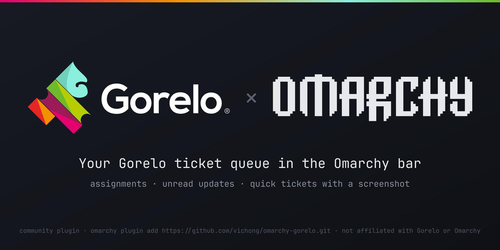
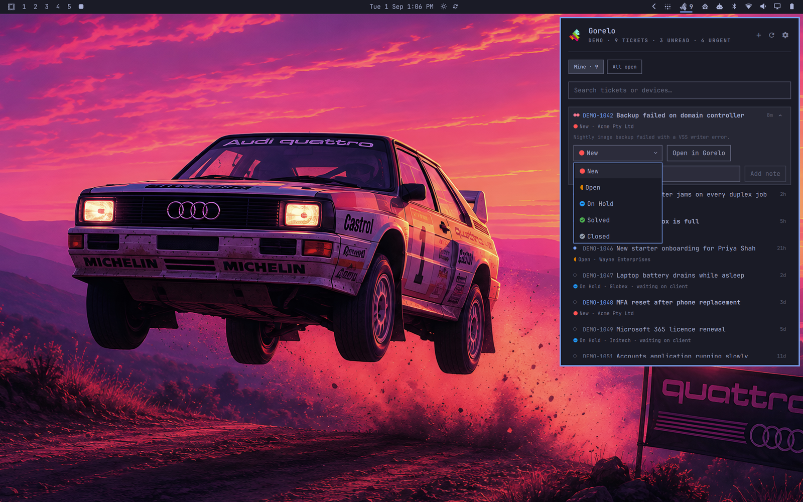
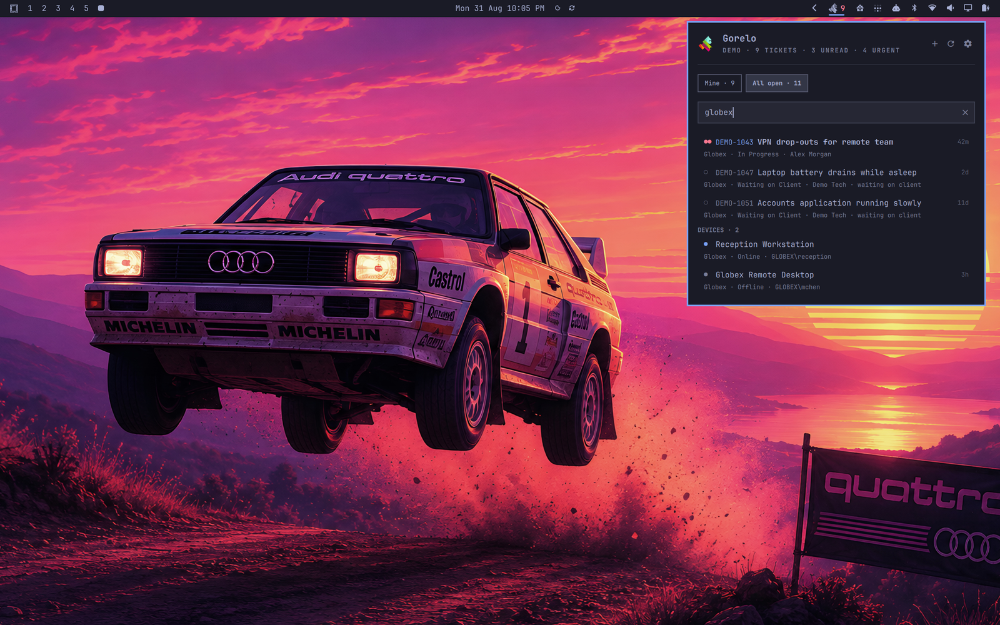
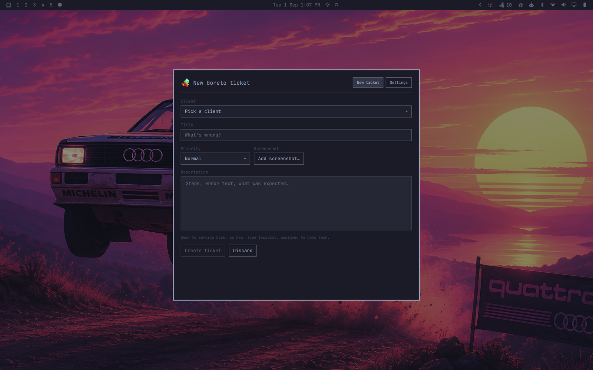
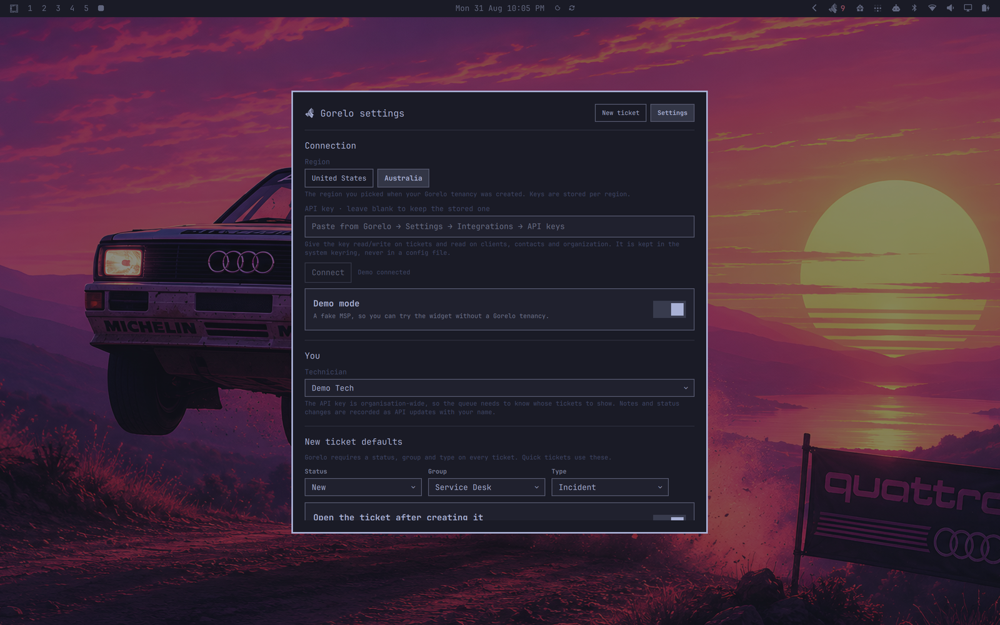

# Gorelo for Omarchy



Your [Gorelo](https://www.gorelo.io/) ticket queue in the Omarchy bar, plus a
quick-ticket overlay that can attach a screenshot.

Quickshell plugin for **Omarchy 4**, for technicians who run Omarchy on their
own workstation. Gorelo has no Linux agent — this is the tech's side of the
desk, not a managed endpoint.

> Not affiliated with or endorsed by Gorelo or Omarchy. The Gorelo and Omarchy
> marks belong to their respective owners and are used here only to identify
> what this plugin connects.

## Screenshots

Demo mode on the stock Omarchy *Quattro* wallpaper — no tenancy required to
get this far.

| Queue | Search: tickets and devices |
|:---:|:---:|
|  |  |
| **New ticket** | **Settings** |
|  |  |

## What you get

- **Bar widget** — the Gorelo mark with a count of open tickets assigned to
  you. Accent-coloured when something is unread, urgent-coloured when an
  Urgent/High ticket is in your queue. Left click opens the queue, right
  click opens a new ticket, middle click refreshes.
- **Queue popup** — *Mine* and *All open* tabs, sorted urgent-first then by
  last update. Each row shows number, title, client, status, age, unread and
  "waiting on client" state. Click or Enter opens the ticket in the browser;
  unfold a row for a status dropdown, *Assign to me* and a private note.
  Its search bar filters the loaded queue as you type and also finds managed
  computers by device name or last logged-on user. Press Enter to search
  tickets and device names across the server too, including closed tickets;
  click a device to open its page in Gorelo.
- **Notifications** — when a ticket is assigned to you, or one of yours gets
  an unread update. Click the notification to open the ticket. Threshold by
  priority.
- **New ticket overlay** — client (searchable), title, priority, description
  and an *Add screenshot…* button that hides the overlay, runs the Omarchy
  region screenshot, and comes back with the file attached. The ticket lands
  in your default group/status/type, assigned to you, and opens in the
  browser.
- **Settings overlay** — region (United States / Australia), API key, which
  technician you are, new-ticket defaults, statuses shown, poll interval,
  notification threshold, ticket and device URL templates, and which installed
  browser opens Gorelo links (system default, or any browser from the
  applications menu).

## Keyboard

The queue follows the same conventions as every Omarchy panel: `↑`/`↓` (or
`j`/`k`) move, `←`/`→` switch tab, `enter` opens the ticket, `/` focuses the
search box (where `enter` runs the server search), `esc` clears the search or
closes, `tab` moves to the next bar panel. Everything else is a button.

## Scripting

The widget is reachable over the shell's IPC, so a keybind can drive it:

```bash
omarchy-shell gorelo toggle          # open/close the queue
omarchy-shell gorelo newTicket       # quick ticket overlay
omarchy-shell gorelo settings
omarchy-shell gorelo refresh
omarchy-shell gorelo ticket <id>     # open a ticket in the browser
omarchy-shell gorelo tab all         # or: mine
omarchy-shell gorelo status          # redacted state line, for bug reports
```

Example `~/.config/hypr/bindings.lua`:

```lua
o.bind("SUPER + SHIFT + G", "New Gorelo ticket", "omarchy-shell gorelo newTicket")
```

## Requirements

- Omarchy 4 (`schemaVersion: 1` plugin API)
- `secret-tool` (libsecret) with a running keyring daemon
- `curl` (screenshot uploads only) and `gio` from glib (only when a specific
  browser is chosen in Settings; the system default uses the desktop's
  URL handler)
- A Gorelo API key: **Settings → Integrations → API keys**, with read/write on
  tickets and read on clients, organization and assets

## Install

```bash
omarchy plugin add https://github.com/vichong/omarchy-gorelo.git --enable
```

For local development, symlink the checkout instead:

```bash
ln -sfn "$PWD" ~/.config/omarchy/plugins/io.github.vichong.gorelo
omarchy restart shell
omarchy plugin enable io.github.vichong.gorelo right
```

## Setup

Click the gear in the popup header. From a
terminal: `omarchy-shell gorelo settings`.

**Try it without a tenancy:** turn on **Demo mode** under *Connection*. The
widget starts a fake MSP locally, with sample tickets and devices; it does not
read the keyring or contact Gorelo. Turn it off to return to your normal region
and stored API key.

1. Pick your **region** — the one your Gorelo tenancy was created in.
   US keys talk to `api.usw.gorelo.io`, Australian keys to
   `api.aue.gorelo.io`. Keys are stored per region.
2. Paste the **API key** and press Connect.
3. Pick **yourself** under *You*. The key is organisation-wide, so the queue
   needs to know whose tickets to show.
4. Set the **new ticket defaults** — Gorelo requires a status, group and type
   on every ticket.

Optionally adjust which statuses count as "open" (by default anything whose
name doesn't look closed, resolved or cancelled), the poll interval, and the
notification threshold.

## Configuration

Everything user-facing is in the Settings overlay (`omarchy-shell gorelo
settings`) and is written to `~/.config/omarchy/gorelo/config.json` — except
the API key, which only ever lives in the keyring. Move the widget with
`omarchy bar move io.github.vichong.gorelo --section left`.

Per-instance options live on the widget's entry in
`~/.config/omarchy/shell.json`:

```json
{ "id": "io.github.vichong.gorelo", "colorful": true, "showCount": true }
```

`colorful` paints the small bar icon in Gorelo's brand palette instead of the
theme foreground (the large mark inside the popup is always in brand colours);
`showCount` hides the number next to the icon when false.

## Removal

```bash
omarchy plugin remove io.github.vichong.gorelo
secret-tool clear service gorelo region usw   # and/or: region aue
rm -r ~/.config/omarchy/gorelo
```

`omarchy plugin remove` takes the widget out of the bar and deletes the
checkout; the two extra lines remove the stored API key and the settings file.
The plugin never touches any other configuration.

## Limits of the public API

- No webhooks or streaming; the plugin polls (90 s by default). Gorelo
  rate-limits bursts: polls back off (up to 10 min) and a connection that
  fails on a rate limit, network or server error retries by itself (30 s, doubling
  to 5 min).
- A server search returns the 50 most recently updated matches. The device
  cache holds up to 2,000 computers and refreshes every 30 minutes; Enter
  also asks Gorelo directly, so machines beyond the cache are still found.
- Each queue fetch is capped at five 100-ticket pages. When more results are
  available, the panel says that it is showing the first 500.
- Comments posted through the API are recorded as API-authored, with your
  name attached. The plugin only ever posts *private* notes.
- Time entries cannot be created through the API, so there is no timer.
- The ticket URL is a template (`{id}`, `{number}`, `{displayNumber}`) because
  the web app's path isn't documented; change it in Settings if yours differs.
- The device URL is likewise configurable in Settings with `{id}` and the
  URL-encoded computer `{name}` placeholders.

## Roadmap

- **Remote control from the widget.** Gorelo is building *Connect v2*, a
  browser-based remote access tool (see the
  [feature post](https://feedback.gorelo.io/p/desktopcomputer-gorelo-connect-v2)).
  Once it ships, clicking a device in the search results will start a
  Connect session — the device click already goes through a single
  `openDevice()` hook, so this is a URL swap — with the session opened as an
  Omarchy web-app window that can live on its own workspace. Planned
  follow-ons: a *Connect* button on tickets with linked devices, an
  in-session indicator in the bar, and "add a note to the ticket" when the
  session ends.
- Ticket rows showing their linked devices (`AgentAssetIds`), once the API
  exposes them on the list endpoint.

## Security

- The API key is stored in the system keyring via `secret-tool` and held in
  memory by the shell. It is never written to `config.json`, logs, IPC output
  or process arguments — the screenshot upload hands it to `curl` through a
  config file on stdin.
- Because the key is held in the shell's memory, it would be present in a core
  dump of the shell process.
- Qt's `XMLHttpRequest` follows redirects with headers. The plugin rejects a
  completed response redirected away from the configured Gorelo API base, but
  a compromised API edge could still redirect the key before that check runs.
- Everything the API returns is rendered as plain text.
- Screenshots are captured under the private `$XDG_RUNTIME_DIR/gorelo`
  directory (mode `0700`) and removed after upload, failure, removal or discard.
- `config.json` in `~/.config/omarchy/gorelo/` holds non-secret settings only.

## Tests

```bash
node tests/test_api.js
node tests/test_model.js
node tests/test_config.js
node tests/test_demo.js
omarchy plugin validate .
```

## License

MIT — see [`LICENSE`](LICENSE).
